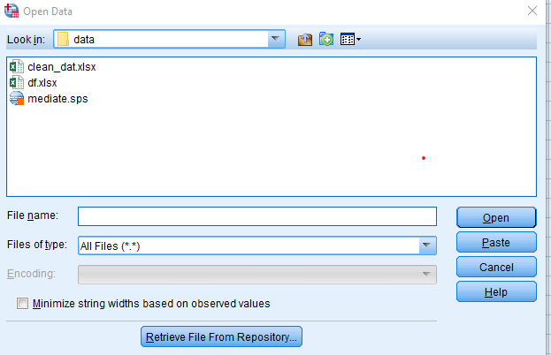

# Cleaning data

```{r, echo = FALSE, include = FALSE}
library (tidyverse)
library (kableExtra)
library (downloadthis)
```

```{r, echo = FALSE, include = FALSE}
df <- rio::import ("data/df.xlsx")
```

Here is the data which you can download to practice the steps in this chapter in SPSS.


```{r, echo = FALSE}
df %>%
  kable() %>%
  kable_styling() %>%
  scroll_box(width = "100%", height = "500px")

df %>%
  download_this(
    output_name = "data",
    output_extension = ".xlsx",
    button_label = "Download data",
    button_type = "warning",
    has_icon = TRUE,
    icon = "fa fa-save"
  )
```

## Recipe 1 - Paste to syntax {#Recipe1}

**If you can develop one habit, it is this!!!** The good thing about interacting with SPSS using syntax, is that you do not have to be a total syntax convert. You can continue using the "point and click" interface, but instead of executing the command, press **paste** as you see in Figure \@ref(fig:paste-syntax). Pasting automatically copies the word version of what you clicked into your opened syntax.

```{r paste-syntax, fig.cap="Paste the syntax you generated implicitly by clicking", out.width = '60%', echo = FALSE}



```

I have not ever encountered an SPSS function that does not eventually have a paste function. Try finding it and saving what you intend to do like in Figure \@ref(fig:paste-syntax2).

```{r paste-syntax2, fig.cap="Always try to paste your syntax rather than executing", out.width = '50%', echo = FALSE}

knitr::include_graphics("images/paste_syntax2.png")

```

To run each command, highlight and press the play button like in Figure \@ref(fig:play).

```{r play, fig.cap="Executing a command", out.width = '100%', echo = FALSE}

knitr::include_graphics("images/run_syntax.png")

```

## Recipe 2 - Setting your work directory {#Recipe2}

When importing data from deeply nested folders, can be a pain to do so. In addition, when exporting files or figures, many often scratch their head as to where the files went to. The solution to this is to **explicitly** define the folder on your computer where everything starts and ends. All the files will be exported to that folder. And importing becomes a breeze.

You can set the working directory by pasting the command below into your SPSS syntax, and changing the folder path to your path. Just make sure to enclose it in `" "`.


```{r eval = FALSE}
cd 'C:\Box\myBox\Documents\teaching\Statistics\SPSS\wrangling\Essex_SPSS_summer\data'.
```

## Recipe 3 - Importing data {#Recipe3}

The most common starting point for data analysis is Excel, so I will demonstrate how to easily import an Excel file. Paste the command below into your syntax, and simply change the file name `df.xlsx` to whatever your file is named. Remember not to change the file extension `.xlsx`. Notice I did not do this `"'C:\Box\myBox\Documents\teaching\Statistics\SPSS\wrangling\Essex_SPSS_summer\data\df.xlsx'"`. It was because I already defined the path the file was in Recipe \@ref(Recipe2). If your Excel file has multiple sheets, change the sheet name `jump` to whatever it is named. If you only have one sheet, you can leave it blank.

```{r eval = FALSE}
GET DATA
  /TYPE=XLSX
  /FILE= 'df.xlsx'
  /SHEET=name 'jump'
  /CELLRANGE=FULL
  /READNAMES=ON
  /DATATYPEMIN PERCENTAGE=95.0
  /HIDDEN IGNORE=YES.
```

Using the sample data I provide, this is what the data looks like in Figure \@ref(fig:original).

```{r original, fig.cap="Original data", out.width = '100%', echo = FALSE}

knitr::include_graphics("images/original_data.png")

```

## Recipe 4 - Rename columns {#Recipe4}

Renaming columns is a common task. Paste the command below into your syntax and run it. Put all the original column names before the `=` and all the new names after. There must be spacing between each name, and the order preceding and proceeding with the `=` must be identical.

```{r, eval = FALSE}
RENAME VARIABLES (subj group wt  = id grp weight).
```

After renaming, this is what the data looks like in Figure \@ref(fig:rename-col).

```{r rename-col, fig.cap="New column names", out.width = '100%', echo = FALSE}

knitr::include_graphics("images/rename.png")

```

## Recipe 5 - Filter rows {#Recipe5}

You might want to keep rows in your data based on some conditions. I tend to prefer to keep whatever rows I want and discard the remaining. Discarding your data does not harm your original data in Excel. If you change your mind, just highlight all the commands from the start and press the play button. In the example below, I want to keep rows where the variable `task` is equal to`"cmjbw"` AND `side` is equal to "`R`". Below are some of the operators you can mix and match to powerfully filter your data.

| Symbols |   Meaning |
|:--------|----------:|
| `=`     |Equal | 
| `~=`    |Not equal | 
| `<`     |Less than | 
| `<=`     |Less than or equal| 
| `>`      |More than | 
| `>=`     |More than or equal | 
| `&`     |AND | 
| `|`     |OR | 


```{r eval = FALSE}


FILTER OFF.
USE ALL.
SELECT IF (task = "cmjbw" &  side = "R").
EXECUTE.

```

After filtering, this is what the data looks like in Figure \@ref(fig:filter-row).

```{r filter-row, fig.cap="Keeping rows based on some conditions", out.width = '100%', echo = FALSE}

knitr::include_graphics("images/filter.png")

```

## Recipe 6 - Create new variables {#Recipe6}

You might want to create new variables, such as calculating BMI from height and mass. Add as many `COMPUTE` functions below as needed. The command reads as `COMPUTE height = ht/100.`, make a new variable called `height` by dividing the original variable`ht` by 100. You can either create a new variable or replace the existing variable by using a new name or the original name, respectively.

**Math functions**

`+` Add

`-` Subtract

`/` Divide

`*` Multiply

`**` Power


```{r eval = FALSE}

COMPUTE height = ht/100. 
COMPUTE weight = weight/100.
COMPUTE BMI = weight/(height**2).
EXECUTE.

```

After computing new variables, this is what the data looks like in Figure \@ref(fig:mutate).

```{r mutate, fig.cap="New variables created", out.width = '100%', echo = FALSE}

knitr::include_graphics("images/mutate.png")

```

## Recipe 7 - Group by function {#Recipe7}

Many times you want to do the same thing repeatedly on certain chunks of data. For example, you want to find the mean strength on each level of sex (male, female), or even each level of the combination of sex-side (male-right, male-left, female-right, female-left). Precede whatever function you want to execute, with the command below. In the command below, I want to do the same analysis for each level of the combination of `grp` and `time`. This works for categorical variables. Replace `grp` and `time` with however many variables you want to split the data by.

*PS* This means you can run the same stats on each split of the data by running the stats only once if you use this command.


```{r eval = FALSE}

SORT CASES  BY grp time.
SPLIT FILE SEPARATE BY grp time.

```

After grouping the data, when I ran a descriptive analysis, this is what the results looks like in Figure \@ref(fig:group-by).

```{r group-by, fig.cap="Group-by descriptives", out.width = '60%', echo = FALSE}

knitr::include_graphics("images/group-by.png")

```

## Recipe 8 - Aggregate data {#Recipe8}

You may want to find some summary statistics for each level of a grouping variable. In the example below, I want to calculate for each id, in each group, at each time, find the mean (`MEAN`), minimum (`MIN`), maximum (`MAX`), standard deviation (`SD`), and median (`MEDIAN`) of the following variables (`aexttorq`, `aextwork`, `aextpow`). When you see this argument, `/aexttorq_mean=MEAN(aexttorq)`, the value before `=` represents the new variable name. However many aggregate values you desire, add as many arguments on a separate line. In this command, the aggregate data is pasted onto a separate data window called `aggregate_data` - you can give the new data window any name.

```{r, eval = FALSE}
DATASET DECLARE aggregate_data.
AGGREGATE
  /OUTFILE='aggregate_data'
  /BREAK=id grp time 
  /aexttorq_mean=MEAN(aexttorq) 
  /aextwork_min=MIN(aextwork) 
  /aextpow_max=MAX(aextpow) 
  /aexttorq_sd=SD(aexttorq) 
  /aextwork_median=MEDIAN(aextwork).

```

After aggregating, this is what the data looks like in Figure \@ref(fig:aggregate).

```{r aggregate, fig.cap="Aggregated summary", out.width = '100%', echo = FALSE}

knitr::include_graphics("images/aggregate.png")

```

## Recipe 9 - Long to wide {#Recipe9}

The two key commands are `/ID=id grp` and `/INDEX=time`. `/ID` represents how each data point will be uniquely identified. `/INDEX` represents the variable you want to spread by.

Notice that Recipe \@ref(Recipe9) and \@ref(Recipe10) are mirror images. the `/ID` command in Recipe 10 should be identical to the `/KEEP` in Recipe \@ref(Recipe9). The `/INDEX` in both Recipes \@ref(Recipe9) and \@ref(Recipe10) should contain the variable name you want to spread by.

```{r eval = FALSE}

CASESTOVARS
  /ID=id grp
  /INDEX=time
  /GROUPBY=VARIABLE.

```

```{r ugly, fig.cap="Wide data", out.width = '100%', echo = FALSE}

knitr::include_graphics("images/wide_data.png")

```


## Recipe 10 - Wide to long {#Recipe10}


Typically data is keyed into Excel in the wide-format like in Figure \@ref(fig:ugly). In \> 90% of any data analysis, data should **NOT** be in this format. The only thing I know in SPSS that requires data to be in the wide-format is when you want to use Repeated Measures Anova or a Paired t-test. So it is useful to know how to convert data to a long format since \> 90% of SPSS function requires data to be in a long format.

`/MAKE aexttorq_mean FROM aexttorq_mean.POST aexttorq_mean.PRE` says to collect all the variables `aexttorq_mean.POST`, `aexttorq_mean.PRE` and stack their values on top of each other. The column containing the values is called `aexttorq_mean`. The column where the names of the values are stored is called `time`. Remember, you can call the new columns anything you want. `/KEEP=id grp` simply says keep the following columns in the new data.


```{r eval = FALSE}

VARSTOCASES
  /MAKE aexttorq_mean FROM aexttorq_mean.POST aexttorq_mean.PRE
  /INDEX=time"POST, PRE"
  /KEEP=id grp 
  /NULL=KEEP.


```

After running the command, this is what the results looks like in Figure \@ref(fig:tidy).

```{r tidy, fig.cap="Long data", out.width = '100%', echo = FALSE}

knitr::include_graphics("images/long_data.png")

```


## Conclusion

Notice how I did not even touch on saving any outputs. The reason for that is that one should first save all the commands ran rather than the results. Saving the process allows you to replicate your actions, saving your results will not.
