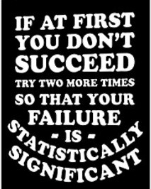
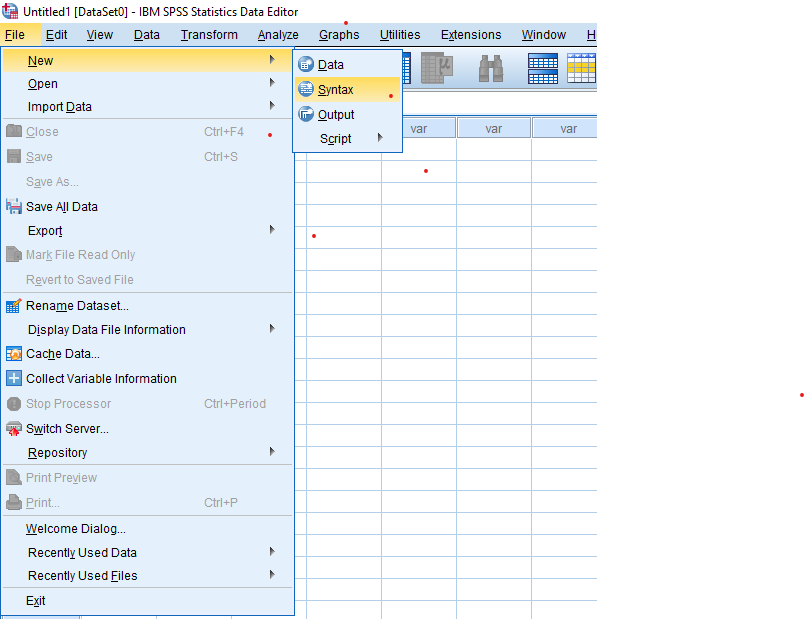

--- 
title: Statistics done ALMOST right - an SPSS syntax recipe book
author: "Bernard Liew"
date: "`r Sys.Date()`"
site: bookdown::bookdown_site
documentclass: book
bibliography: book.bib
biblio-style: apalike
link-citations: yes
cover-image: images/cover_image.png
output: bookdown::gitbook
---

# Introduction 


```{r fig.align='center', echo=FALSE, out.width = '75%'}

```

## Where did this book come from?

**No I do not want people to fail in statistics if that is what you are thinking. On the contrary, I want to help people who hate statistics pass it and use it well.** Statistics involve multiple back and forth stages including getting data ready for performing the statistics, understanding various statistical tests, knowing what statistical test to choose, executing the test, reporting the results, and plotting... I may have probably forgotten a few steps. You get the point - it is convoluted.

What most statistical classes do not teach too well, if at all, is learning how to get data ready for any statistics. Cleaning data and getting it ready will likely eat up >70% of your time. Statistics per se is quick!!!

Most people interact with SPSS using what I call the "point and click" interface. A point-click method is not wrong per se, I use it. The bad thing about the point-click method is that:

1) You cannot easily remember what you did. Try recalling the exact order of actions you undertook the last time you analyzed your data in SPSS. It is for this reason that one gets nervous reproducing the results.

2) It gets tedious quickly, especially if you want to do the same thing repeatedly.

The alternative to the "point and click" interface, is using the **SPSS syntax**. The syntax is all about typing. You can open a fresh syntax like in Figure \@ref(fig:first-syntax), populate it with commands to run, and save it. My rule of thumb is when you spend so long getting something  running, save your effort, not your the consequence of that effort.


```{r first-syntax, fig.cap="Open your first syntax", out.width = '100%', echo = FALSE}



```

Figure \@ref(fig:full-syntax) shows what a full syntax looks like when you string together a bunch of commands.

```{r full-syntax, fig.cap="What a full syntax looks like", out.width = '100%', echo = FALSE}

knitr::include_graphics("images/example_syntax.png")

```

## What this book offers?

This book offers you very common "cut-and-paste" style recipes to tidy your dirty data to get it ready for statistics, and recipes for common statistical methods. I have taken the liberty to select some default settings on all the statistical tests. These default settings I believe, even though not necessarily 100% right, very closely approximate the right answers. For novices, this book will be all you need to execute basic statistical tests in SPSS.

## Who this book isn't for?

This book is not for connoisseurs of statistics. If you find yourself disagreeing a lot with the default parameters I use for the syntax, you likely need resources beyond this book. However, if you do find errors, strongly feel that a better default should be used, or want more recipes added, do contact me.

